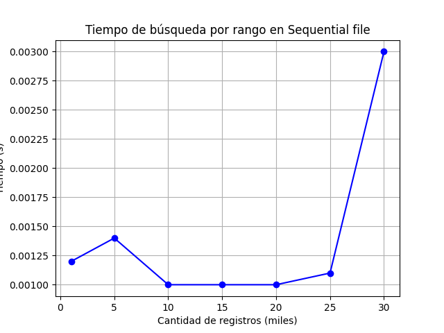
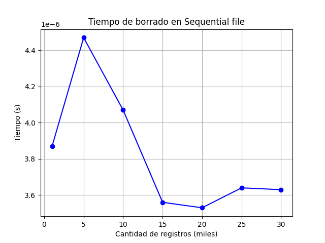
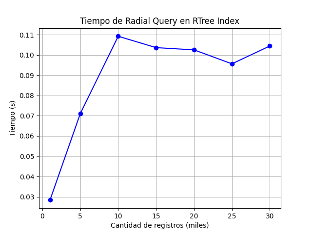
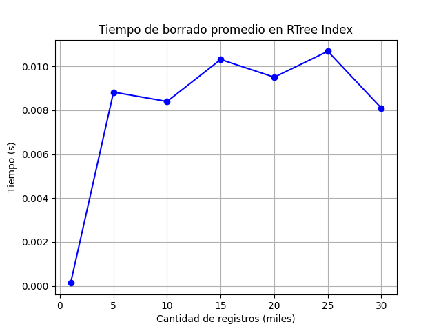

# Multimodal_Database

Sistema de Base de Datos Multimodal con Indexación Avanzada

## Dataset
Utilizamos el dataset `cities` que tiene `148061` registros con los siguientes atributos: 
- `id`: id de la ciudad
- `name`: nombre de la ciudad
- `state_id`: id del estado
- `state_code`: código del estado
- `state_name`: nombre del estado
- `country_id`: id del país
- `country_code`: código del país
- `country_name`: nombre del país
- `latitude`: coordenada latitud
- `longitude`: coordenada longitud
- `wikiDataId`: id de la ciudad registrado en wikidata.org

---

## Extendible Hashing

Extendible Hashing que mantiene el índice en RAM y los buckets en disco, permitiendo inserciones, búsquedas, splits y overflows de forma eficiente.

### Estrategias utilizadas en la implementación

### Estructura general
Mientras estamos trabajando sobre el archivo del índice lo almacenamos en RAM para poder hacer operaciones de forma más eficiente. Cada cambio hecho al
índice en RAM también se hace al archivo del índice, así podemos tenerlo en disco y abrirlo nuevamente después. Por ejemplo el índice para 1 millón de
datos con `32768` entradas pesa menos de `1MB`.

Se tiene un factor de balanceo `fb` que indica la cantidad de registros por bucket y una profundidad global `D` para poder manejar los splits.

Los buckets se construyen sobre el mismo archivo `data.bin`. Para cada bucket tenemos un header que almacena lo siguiente: 
- El número del bucket en decimal `bucket_id`
- La profundidad local `d`
- El siguiente bucket de overflow `next`
- La cantidad de registros no vacíos en el bucket `size`
- fb registros que se inicializan como registros en blanco

Reservamos fb registros para cada bucket. Simplemente esos registros son el constructor por defecto `Registro()`, representando un registro vacío. Cada vez que se inserta sobreescribimos esos registros y actualizamos el size del bucket, la cantidad de registros no vacíos.

### Search
Se implementó la función `get_reg_attributes()` que la búsqueda de un elemento en los buckets principales y overflow. Retorna el registro encontrado en
la búsqueda (si existe), la posición del registro y el número del bucket. Así podemos simplemente reutilizar esta función en `search()` y `remove()`. El 
registro encontrado lo usamos en la búsqueda y los otros dos valores del retorno usamos en el método de borrado para poder acceder directamente al registro
y bucket asociado. Así evitamos repetir código.

### Remove y reconstrucción
La estratégia de borrado que utilizamos es la siguiente: 
- Simplemente reemplazamos el registro que queremos borrar por un "registro vacío" (constructor por defecto de `Registro()`).
- Contamos la cantidad de buckets vacíos (sin registros reales).
- Si la cantidad de buckets vacíos sobrepasa a los 40% hacemos una reconstrucción total del índice y de los buckets.

### Insert
Aplicamos hash al id numerico de los registros. Simplemente se inserta en el primer espacio vacío que se encuentra del bucket correspondiente a ese hash. 
Así reutilizamos los espacios que fueron borrados en remove. Si la profundidad local del bucket es menor a la profundidad global hacemos split en caso el
bucket esté lleno. En caso ya no se pueda hacer split creamos buckets de overflow y los encadenamos.

### Experimentación y Resultados
Para la experimentación variamos los parámetros `fb` y `D` para poder tener una distribución de registros y un índice balanceado, ya que las pruebas varían
en la cantidad de datos. Así logramos tener tiempos eficientes para inserción, búsqueda y borrado. Utilizamos los siguientes valores:

| Registros | fb  | D  |
|-----------|-----|----|
| 1k        | 4   | 8  |
| 10k       | 6   | 10 |
| 100k      | 6   | 10 |
| 250k      | 10  | 12 |
| 500k      | 16  | 14 |
| 1M        | 18  | 15 |

Con estos parámetros obtuvimos la siguiente cantidad de buckets y entradas en el índice: 


### Insert
Hicimos la inserción de acuerdo a los valores de `fb` y `D` en la tabla de arriba:


### Search
Hicimos la búsqueda de 100 keys aleatorios del dataset y sacamos el promedio: 


### Remove
Hicimos el borrado de 100 keys aleatorios del dataset y sacamos el promedio: 


---

## ISAM

La implementación del sistema de acceso secuencial indexado (ISAM) se diseñó con el objetivo de simular un sistema de archivos jerárquico eficiente, con soporte para inserción, búsqueda y eliminación. A continuación se detallan las estrategias clave empleadas:

### 1. Estructura Multinivel
Se utilizó una estructura jerárquica de dos niveles de indexación:
- **Root Index (`root_index.bin`)**: Apunta a páginas del índice intermedio.
- **Index Pages (`index_pages.bin`)**: Contienen referencias a páginas de datos.
- **Data Pages (`data_pages.bin`)**: Almacenan los registros ordenados de forma secuencial.

Esto permite búsquedas logarítmicas y navegación eficiente por los niveles del índice.

### 2. Segmentación por Archivos
Cada nivel de la estructura se almacena en un archivo binario independiente:
- `root_index.bin`
- `index_pages.bin`
- `data_pages.bin`
- `overflow.bin` (para las inserciones que no se pudieron hacer en el área principal)

Esta segmentación facilita el manejo modular del almacenamiento y el acceso por niveles.

### 3. Bloques con Factor Fijo
Se utilizó un **factor de bloqueo fijo**:
- `BLOCK_FACTOR_DATA = 5`: Número máximo de registros por página de datos.
- `BLOCK_FACTOR_INDEX = 4`: Número máximo de entradas por página de índice.

Esto asegura una estructura uniforme de páginas, facilita el cálculo de offsets y permite navegación por saltos fijos.

### 4. Registros Fijos y Serialización con `struct`
Todos los registros (`Registro`) e índices (`IndexEntry`) se serializan usando el módulo `struct`, con un formato fijo (`FORMAT`) que asegura un tamaño constante en disco. Esto permite:
- Cálculo directo de posiciones (offsets) sin recorrer todo el archivo.
- Acceso eficiente a cualquier página o registro.

### 5. Área de Desborde (`overflow.bin`)
Las inserciones no se hacen en las páginas de datos (por la naturaleza estática del ISAM), sino que se redirigen a un archivo de desborde. Esto mantiene el área principal inalterada y permite realizar operaciones de inserción sin reorganizar el índice.

### 6. Búsqueda Binaria Aproximada por Niveles
Para cada búsqueda:
1. Se localiza la página adecuada en `root_index.bin`.
2. Luego se baja a la página de índice correspondiente.
3. Finalmente se accede a la página de datos que contiene o debería contener el registro.
4. Si no se encuentra, se busca en el `overflow.bin`.

Esta estrategia imita el comportamiento real del ISAM y permite realizar búsquedas eficientes con costo O(log n) en el mejor caso.

### 7. Lectura y Escritura Página por Página
Para mejorar la eficiencia y evitar acceso por registro, se leen y escriben bloques completos (páginas) en lugar de registros individuales.

---
## Sequential File

La implementación del Sequential File se diseñó para que trabaje en un solo archivo (sin metadata) con cabezera, usando las técnicas del espacio auxiliar y linked records.

#### Espacio auxiliar 

El archivo esta dividido en dos partes: la página principal y el espacio auxiliar. En este último es donde se irán insertando los registros hasta llegar a un *threshold* ($O(n)$ donde $n$ es la cantidad de registros en la página principal). 

Una vez alcanzado, reconstruiremos la página principal, donde se reorganizarán todos los registros (incluyendo los del espacio auxiliar) ordenados por una key predeterminada por el usuario.

El propósito de este diseño es para resolver el problema de desborde de espacio, así como ahorrarse las complejidades de mantener ordenados todos los registros constantemente.

#### Linked records

Para hacer más fácil la preservación de orden, se agregó un campo *next* a cada uno de los registros, que almacena la posición física del siguiente registro según el orden lógico del archivo (determinado por una *key*).

Esta decisión trivializa las operaciones de borrado, donde solo desenlazamos el registro a eliminar, liberando su espacio para la siguiente reconstrucción.

### 1. Inserción

En nuestra implementación, la inserción ocurre dentro del espacio auxiliar, donde se apilan los registros. Con cada inserción actualizamos el conteo de registros en la cabezera. Si dicha inserción activa una alerta de desborde, entonces se reconstruye el archivo, limpiando el espacio auxiliar.

Descontando el coste de reconstrucción, las inserciones cuenta con complejidad $O(1)$.

### 2. Búsqueda singular

El diseño de la implementación le otorga al *sequential file* la capacidad de búsquedas binarias bajo una *key*. Este tipo de búsquedas se caracterizan por ser el tipo de búsqueda más eficiente, puesto que cuenta con complejidad de apenas $O(\log n)$.

Para optimizarla aún más, se utilizó la librería ```bisect``` de Python, lo que nos garantiza búsquedas veloces.

### 3. Búsqueda por rango

Para las búsquedas por rango, se aplicaron dos búsquedas binarias para ubicar las posiciones del elemento iniclal y final del rango. Una vez encontrado, solo se recorría dicho rango se forma linear.

Este diseño nos da una complejidad $O(\log n)$ para las búqueda de los índices y $O(m)$ para recorrer el rango. Asumiendo que $m < n \to m \approx \log n$, nos da una complejidad final de $O(\log n)$.

### 4. Borrado

Como se mencionó anteriormente, el borrado consiste en desenlazar el registro, uniendo el registro anterior con el siguiente según el orden lógico del archivo. Sin embargo, no se contó con agregar un atributo *prev* para guardar la posición del archivo anterior, lo que impide hacer uso de una búsqueda binaria para ubicar el registro a borrar.

Por lo tanto, se empleó una búsqueda sequencial sobre el archivo, almacenando la posición del registro anterior hasta encontar el registro correcto. Una vez ubicado, se desenlaza a través del campo *next* de cada registro.

Este diseño nos da un costo $O(n)$ del borrado en el peor de los casos.

### Experimentación y resultados

Para la fase de experimentación de este índice, se utilizó un slice del dataset *cities* de distintos tamaños $(1000, 5000, 1k, 15k, 20k, 25k, 30k)$ y se determinó como llave al ```id``` de los registros. Se analizaron los tiempos de ejecución de cada uno de los métodos para cada tamaño del dataset, con el fin de analizar su rendimiento.

#### Inserción


#### Search

Se aplicó un ```search()``` a 100 elementos aleatorios, promediando el tiempo final.


#### Range Search (rango de tamaño 100)



#### Borrado

Se aplicó un ```remove()``` a 100 elementos aleatorios, promediando el tiempo final.



---

## RTree

Para la implementación del índice *RTree*, se diseñó para desacoplarlo del archivo principal, siendo este índice almacenado en múltiples archivos metadata, y se utilizó principalmente la librería ```rtree``` de Python.

El archivo principal solo se encargaría de apilar los registros, siendo una interfaz para el índice *RTree*. Para manejar los borrados, cuenta con una *free list* almacenada en otro archivo aparte.

#### Librería ```rtree```

Esta librería aportó con la implementación de la estructura de datos, así como sus métodos para las inserciones, queries y borrados. Cuenta con métodos para almacenarse en memoria secundaria a través de archivos ```.rtree.dat``` y ```.rtree.idx```. Sin embargo, esta librería contaba con limitaciones que requerían el uso de un archivo metadata personalizado para este proyecto:

- No maneja puntos, por lo que cada registro fue insertado como un rectángulo de area 0.
- La llave de cada una de las hojas requerían un orden incremental, por lo que se utilizó la posición de cada registro en el archivo principal en lugar de su *id*.
- No cuenta con métodos para búsquedas por radio. 

#### Metadata

Se creó un archivo Metadata que almacenaba los campos necesarios de cada registro para los métodos del *RTree* (como posición, longitud, latitud). Principalmente usado por la búsqueda radial y el borrado.

### Métodos

Gracias a la librería, la implementación de los métodos del *RTree* consistió en convertir los hiperparámetros en los adecuados para ejecutar el correspondiente del ```rtree```. Solo dos métodos necesitaron de lógica extra para su correcto funcionamiento:

- ```radius_search((x, y), r)```: se realizó una query sobre el rectángulo definido por los puntos $(x-r, y-r)$ y $(x+r, y+r)$.
Una vez obtenidos los registros extraídos, se filtraron aquellos que excedían su distancia hacia el centro $(x, y)$ calculado con la distancia euclidiana.
- ```erase(pos)```: usando la *metadata*, se obtenían las coordenadas *lon* y *lat* del registro, puesto que ```rtree``` no elimina elementos definidos por la *key*, sino que tambíen necesita de sus coordenadas.

Tanto la inserción como la búsqueda por rectángulo y la búsqueda KNN fueron interfaces de los métodos ```insert(rectangle)```, ```intersects(rectangle)``` y ```nearest(rectangle, k)``` del ```rtree```, siendo los puntos pasados como rectángulos de área 0.

### Experimentación y resultados

Para la fase de experimentación de este índice, se utilizó un slice del dataset *cities* de distintos tamaños $(1000, 5000, 1k, 15k, 20k, 25k, 30k)$. Se analizaron los tiempos de ejecución de cada uno de los métodos para cada tamaño del dataset, con el fin de analizar su rendimiento.

#### Inserción


#### Box Query


#### Radial Query



#### 100-Nearest Neighbors


#### Borrado

Se aplicó un ```remove()``` a 100 elementos aleatorios, promediando el tiempo final.



---

## B+ Index
Con el objetivo de mejorar la eficiencia en las búsquedas sobre archivos de datos, se implementó un índice basado en un árbol B+ no agrupado (unclustered). Esta estructura permite mantener las claves ordenadas y enlazadas en nodos hoja, mientras que los datos reales se almacenan en un archivo separado. Las hojas contienen punteros a la posición física del registro en el archivo de datos.

Además, cada nodo hoja mantiene un campo next que enlaza con la siguiente hoja, lo que permite recorridos eficientes y búsquedas por rango. El árbol maneja claves de tipo int o string (hasta 30 caracteres), según el parámetro de configuración.

La estructura está respaldada por un archivo binario que almacena los nodos, con una cabecera que contiene:

Posición del nodo raíz

Posición libre (para insertar nuevos nodos)

Posición del nodo eliminado (para reutilización de espacio)

### 1. Inserción
La inserción sigue el recorrido típico del árbol B+, localizando la hoja adecuada para insertar la nueva clave. Si la hoja tiene espacio, se inserta ordenadamente. En caso de desbordamiento, se realiza una división (split) del nodo y se propaga hacia arriba si es necesario, manteniendo la altura mínima del árbol.

Cada clave insertada en una hoja se enlaza con una posición exacta en el archivo de datos, actuando como índice secundario.

La complejidad de inserción es $O(\log n)$, correspondiente a la altura del árbol.

### 2. Búsqueda singular
Para realizar búsquedas puntuales, el índice recorre desde la raíz hasta una hoja aplicando comparación binaria en cada nodo para determinar el hijo correspondiente. Una vez en la hoja, se verifica si la clave existe y se retorna la posición del registro en el archivo de datos.

Este diseño garantiza una complejidad de búsqueda $O(\log n)$.

### 3. Búsqueda por rango
Gracias a que las hojas están enlazadas mediante el campo next, la búsqueda por rango es eficiente. Primero, se localiza la primera clave del rango mediante búsqueda estándar. Luego, se recorren las hojas sucesivas mientras las claves estén dentro del rango.

Este diseño ofrece complejidad $O(\log n)$ para ubicar el inicio del rango y $O(m)$ para recorrer $m$ claves dentro del mismo. Bajo el supuesto de que $m \approx \log n$, la complejidad se mantiene en $O(\log n)$.

### 4. Borrado
Actualmente, el índice no implementa una operación de borrado. Sin embargo, se ha considerado la gestión del espacio libre mediante un campo de posición eliminada en la cabecera, pensado para futuras extensiones que permitan reutilizar nodos liberados.

### Experimentación y resultados
Para evaluar el rendimiento de nuestro índice B+, se realizaron pruebas de inserción sobre un subconjunto del dataset cities, usando distintos valores del orden del árbol m (5, 10 , 25 y 100). Cada configuración fue evaluada registrando el tiempo total de inserción y el tamaño final del archivo generado.

Los resultados fueron los siguientes:

m = 5: Tiempo de inserción = 36 segundos, Tamaño del archivo = 3.9 MB

m = 10: Tiempo de inserción = 33 segundos, Tamaño del archivo = 3.3 MB

m = 25: Tiempo de inserción = 31 segundos, Tamaño del archivo = 2.8 MB

m = 100: Tiempo de inserción = 28 segundos, Tamaño del archivo = 2.6 MB

Como se puede observar, aumentar el valor de m mejora tanto el tiempo de inserción como el uso de espacio, debido a que se reducen las divisiones de nodos y se mejora la compactación del árbol. Esto confirma que una mayor capacidad de fan-out en los nodos del B+ Tree puede resultar beneficiosa para datasets de tamaño considerable.